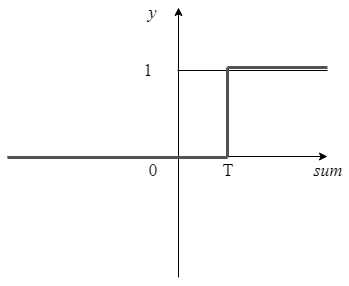

# Perceptron

I created this react app to play with a perceptron, changing the learning rate, the training set, etc and visualizing the neuron while you train it.

# About the perceptron

A perceptron is a linear threshold gate or binary classifier which can decide whether an input belongs to a certain set or not.

The threshold function or linear classifier is a function that maps its inputs to a single binary value. This splits a high-dimensional input space with a hyperplane: all points on one side of the hyperplane are classified as "yes", while the others are classified as "no". In the case of a two dimensions the hyperplane is a line that divides the plane in two sides.

The linear threshold gate, also known as McCulloch-Pitts neural model, models the strength of connections using weights and the threshold phenomenon, a value below the threshold produces no output. The input of the threshold function is the dot product between input feature vector and weights.

The perceptron algorithm introduced the idea of training, if a problem is linearly separable, a single perceptron can find the weights that define the separating hyperplane. In the training proccess, weight updates occur only when the error is greater than zero.

# About the app

When the app is started, an array of 20 random inputs is created, to decide if an input belongs to a class, a base hyperplane is created, in this case a line defined by three parameters.

The sidebar contains buttons to train, change the training set and change the base hyperplane. The bottom part contains information about the training state.

In settings you can change the learning rate and the training set size.

In the top bar you can change the view to:

- The hyperplanes, the green line is the 'base hyperplane' and the blue line is the one defined by the perceptron.
- The inputs and weights, here you can see the inputs, the weights, the products, the bias, etc.
- The error graph, it shows the error for each input vector passed to the perceptron
